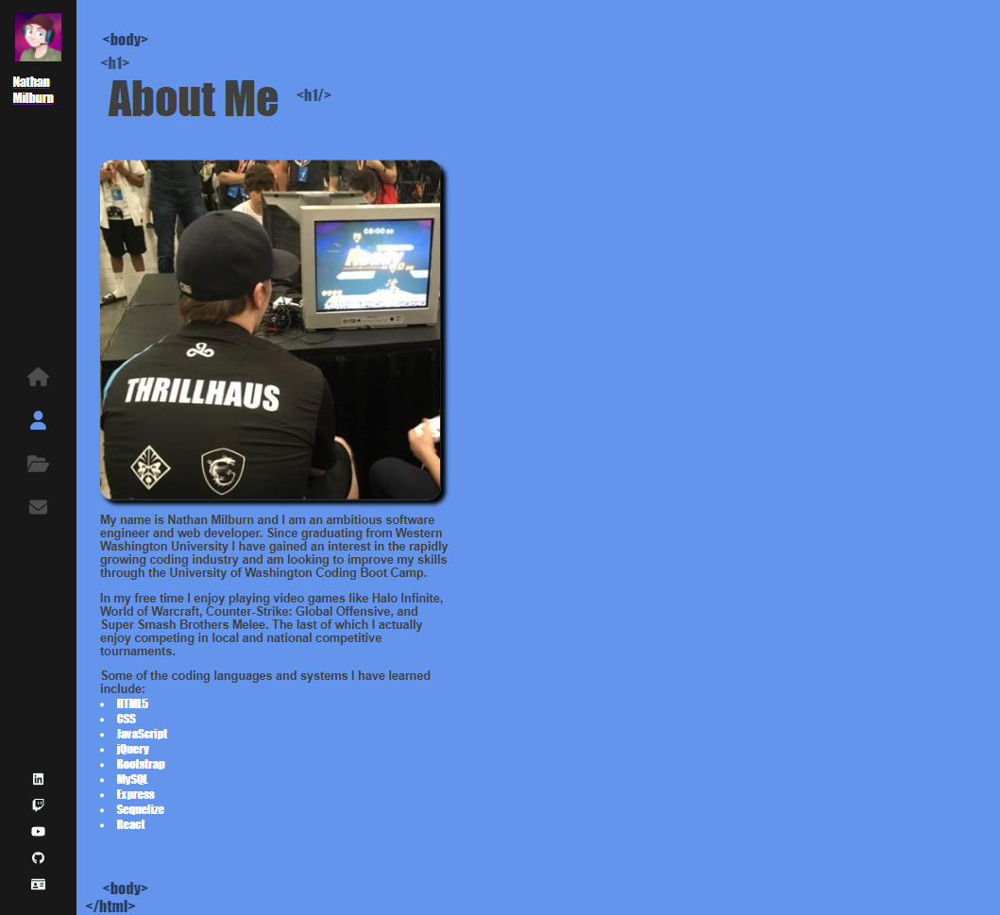

# NBM-PWA-Text-Editor

This project was bootstrapped with [Create React App](https://github.com/facebook/create-react-app).

## USER STORY

    AS A web developer
    I WANT to create a personal portfolio that displays information about myself, how to contact me, and a list of displayed projects using React.js formatting
    SO THAT potential employers can see my skillset with React coding and learn about why I might be a good candidate for their company.

## TABLE OF CONTENTS

- [DESCRIPTION](#description)
- [INSTALLATION](#installation)
- [LICENSE](#license)
- [CONTRIBUTING](#contributing)
- [QUESTIONS](#questions)

## DESCRIPTION

 This portfolio was created entirely with React formatting and takes a completely different styling approach than my original portfolio site. 
 
 Though the formatting and structuring is completely different, I wanted to maintain some consistency with the black, white, light gray, and corn flower blue colorways and Impact font to highlight the original site's design. 

 The pages are a lot more responsive and feature fun animation elements like highlighted single characters slightly resembling piano keys, moving text on page load, and fontawesome icons that direct the user to all of my social links.

Some future developments I would like to include would be looping audio that plays at a low volume (to avoid from being too distracting) as well as loading animations once each page is selected and opened.

Another development I would like to include is video embedding which may require the use of a YouTube API.
 
 Note: `Mobile formatting is created with a breakpoint of 578px I plan on adding more breakpoints in future developments`

## APPLICATION IN USE

LINK TO DEPLOYED SITE FOUND [HERE](https://powerful-reef-01808.herokuapp.com/)

Portfolio Site Homepage

Portfolio Site About Me Page

Portfolio Projects Page 

Portfolio Contact Me Page

## INSTALLATION

This project utilizes node modules like `react`, `react-router-dom`, `sass`, `animate.css`, `react-scripts` and styled through `scss` formatting.

Once proper packages have been installed, simply run `npm run start` which will run the build script and load the portfolio site at the home page.

## LICENSE

The license included for the project is under MIT

## CONTRIBUTING

UW Full-Stack Web Development Boot Camp Class Repo - Week 20 REACT
https://uwa.bootcampcontent.com/UWA-Bootcamp/uw-blv-virt-fsf-pt-12-2021-u-c/-/tree/master/20-React

## QUESTIONS

If you have any further questions about this module or improvement ideas, please feel free to connect on either GitHub or LinkedIn, or email me at:

- GitHub: https://github.com/NathanMilburn
- LinkedIn: https://www.linkedin.com/in/nathan-milburn-55487513a/
- E-Mail: nathan.milburn@outlook.com
